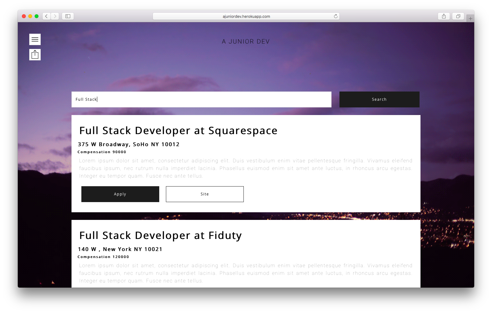

<p align="center">
  
</p>
<h3 align="center">
  A Junior Dev
</h3>
<p align="center" style="color: #999;">Job Board</p>

<p align="center">
  
    </br>
    A minimal job board created for new developers. See it [live](https://ajuniordev.herokuapp.com).
</p>

## Getting Started with A Junior Dev
These instructions will get you a copy of the project up and running on your local machine for development.

### Prerequisites
Things you need to install beforehand:
* **npm** - Javascript package manager.
* [**A Junior Dev - Backend**](https://github.com/SeeYouSpaceCowboy/a-junior-dev-api) - A Junior Dev's backend repo. It's prefered that you install this first.

### Installing

Open terminal and run the following lines of code to clone and run this project.

 ```shell
 $ git clone https://github.com/SeeYouSpaceCowboy/yelp-search-reactjs.git
 $ cd a-junior-dev-react
 $ npm i
 $ npm start
 ```
 This project should now be running locally on port `3000`.

### Installing the Back-end
A Junior Dev consists of a front-end and a back-end. For this project to run you have to have both projects installed and running locally at the same time.

If haven't already, you should now clone and install the back-end of this project; instructions [here](https://github.com/SeeYouSpaceCowboy/a-junior-dev-api).

## Built With
* [Create React App](https://github.com/facebookincubator/create-react-app) - Create React apps with no build configuration.

## Contributors
A Junior Dev was built by [Mohammed Chisti](http://mohammedchisti.com).
